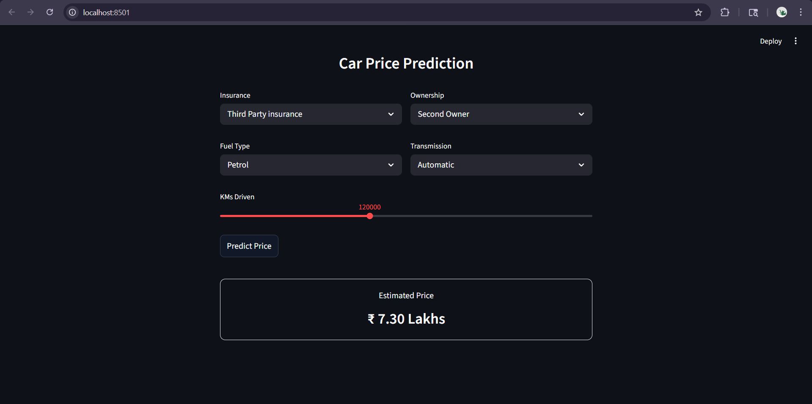

# Car Price Prediction App

A Machine Learning web application that predicts the resale price of a car based on user inputs such as fuel type, ownership, transmission, and kilometers driven.

---

## Preview



---

## Features

* Predict car price instantly
* Clean and modern user interface
* Simple input-based prediction
* Fast and lightweight application

---

## Tech Stack

* Python
* Streamlit
* Scikit-learn
* Pandas
* NumPy

---

## Machine Learning Model

* Algorithm: K-Nearest Neighbors (KNN)
* Trained on processed car dataset
* Model saved using pickle (`.pkl` file)

---

## Project Structure

```
app.py                 # Streamlit web app
final_model.pkl        # Trained ML model
models.ipynb           # Model training notebook
requirements.txt       # Project dependencies
Car Dataset Processed.csv
images/
└── screenshot.png     # App preview image
```

---

## Installation

1. Clone the repository

```
git clone https://github.com/NiharGadhia/Car-Price-Prediction.git
cd Car-Price-Prediction
```

2. Install dependencies

```
pip install -r requirements.txt
```

---

## Run the Application

```
Streamlit run app.py
```

---

## Input Parameters

* Insurance Type
* Fuel Type
* Ownership
* Transmission
* KMs Driven

---

## Output

* Predicted car price in **Lakhs (₹)**

---

## Author

Nihar
